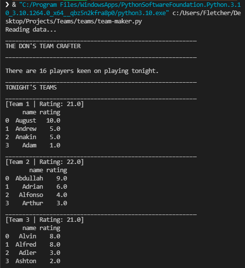
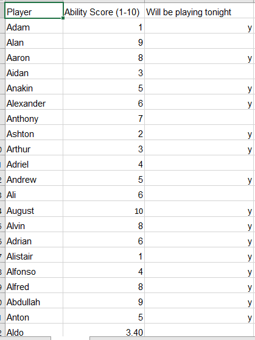

## Team Maker
---
An idea-turned-program that's a basic script for assigning 5-aside football players into teams (based on predefined parameters)

    

### Features
 - Players with the same rating are pseudo-randomly sorted
 - I've added multiple team print options to the script
---

Execution
This script requires an excel datasheet with the following format to execute correctly:
 - single sheet document
 - rows and headers laid out exactly in the pictured format:
 
         
          
---
      
    
Enjoy :-)
